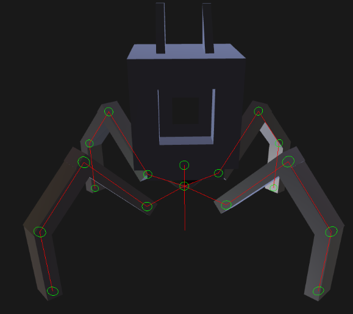

## Introduction | What is Inverse Kinematics?
Inverse Kinematics is a widely used algorithm used in Computer Graphics, Animation, Games and Robotics. For this project I will be focusing on Inverse Kinematics' usage in Computer Animation and Games but the theory is the same across disciplines. 

The purpose of Inverse Kinematics is to calculate joint rotations in a skeleton so that it can reach a target. Here is an example of Inverse Kinematics in Blender:

<video src="blender%20creature%20demo%20rigged.mp4" controls title="Title"></video>

Now that we know what Inverse Kinematics actually is, let's get started!

## Table of Contents
- [Prerequisites](#prerequisites)
- [GLTF Skeletal Hierarchy Set-Up & Forward Kinematics](#gltf-skeletal-hierarchy-set-up-and-forward-kinematics)
- [Bones LookAt](#bones-lookat)
- [Cyclic Coordinate Descent (CCD) IK Solver AlgorithmCCD IK Algorithm](#cyclic-coordinate-descent-ccd-ik-solver-algorithm)
- [FABRIK IK Algorithm](#fabrik-ik-algorithm)
- [Moving Forward](#moving-forward)
- [Conclusion](#conclusion)

## Prerequisites

In this article I will assume that you already have a rigged model to use. You can export it from any 3D software but for this article I will be using GLTF so make sure you export it in the right format. I will not teach you how to make your own GLTF Importer if you are making a project from scratch either. For this project, I am using a custom engine, which already imports the model and skeletal hierarchy. However, mine doesn't support skinning, so I used detached meshes for the model.

In order for Inverse Kinematics to work, we will also need to set-up Forward Kinematics first, which I will explain shortly.

## GLTF Skeletal Hierarchy Set-Up and Forward Kinematics

### Theory

To do any kind of Inverse Kinematics, we first need a Skeletal Hierarchy to work with. Using GLTF, each bone in the model should be represented as a node. In GLTF, nodes follow a Node Hierarchy, such that there are parent and child nodes, similar to a Hierarchy Tree structure. Child nodes are linked to their parent nodes, and if a Transform component is attached to them, then the child will move along with the parent, however the parent will not follow if a child is moved. This is the basics of how Forward Kinematics work. In the custom engine I am suing, this has already been set-up for me, so I don't have to worry about parsing through the GLTF file myself, and I have a Tranform class which stores children and parent nodes.

In this project, I want to make the legs of a robotic creature move thanks to Inverse Kinematics, therefore I first need to create an IK Chain. An IK Chain is simply a list of joints of the leg or arm you want to solve IK on. For my robotic creature, I've made sure to have a consistent naming convention which means that I can find which joint has the name 'foot' in it, then I go back up the joint hierarchy until the desired hierarchy depth has been reached.

### Implementation

To make sure you are reading the GLTF file correctly and are able to access each joint, you can create a debug drawing function like so:

```cpp
void SkeletonDebugDrawing(const entt::entity entity, const int depth = 0)
    {
        auto& transform = Engine.ECS().Registry.get<Transform>(entity);
        for (const auto child : transform)
        {
            const auto* check = Engine.ECS().Registry.try_get<MeshRenderer>(child);
            if (check != nullptr)
                continue;
            SkeletonDebugDrawing(child, depth + 1);
            auto& child_transform = Engine.ECS().Registry.get<Transform>(child);
            const auto& child_position = child_transform.World()[3];
            const auto& position = transform.World()[3];
            float depth_num = depth / 5.f;

            // Debug Drawing
            Engine.DebugRenderer().AddCircle(DebugCategory::Gameplay, child_position, 0.1f, {0.0, depth_num, 0.0, 1.0});
            Engine.DebugRenderer().AddLine(DebugCategory::Gameplay, glm::vec3(child_position), glm::vec3(position),
                                           {1.0, 0.0, 0.0, 1.0});
        }
    }
```

It should look something like this at the end:



I have a function called MakeLeg which creates the IK chain for a creature's leg.

```cpp
int counter = 0;
    const auto view = Engine.ECS().Registry.view<Transform>();
    for (auto& entity : view)
    {
        auto& transform = Engine.ECS().Registry.get<Transform>(entity);

        if (transform.GetInUse() == false)
        {
            // Check if the entity is part of a leg
            if (transform.Name.find("foot") != std::string::npos && counter < 4)
            {
                counter++;
                constexpr int hierarchy_depth = 3;
                transform.SetInUse(true);
                std::vector<entt::entity> leg_ik_chain;
                leg_ik_chain.push_back(entity);

                // Traverse the hierarchy for the leg
                for (int i = 0; i < hierarchy_depth; ++i)
                {
                    entt::entity joint = Engine.ECS().Registry.get<Transform>(leg_ik_chain.back()).GetParent();
                    auto& transform2 = Engine.ECS().Registry.get<Transform>(joint);
                    transform2.SetInUse(true);
                    leg_ik_chain.push_back(joint);
                }

                // Add the leg IK chain to the vector
                std::reverse(leg_ik_chain.begin(), leg_ik_chain.end());
                ik_chain_.push_back(leg_ik_chain);
            }
        }
    }
```

You can see that at the end, I reverse the leg chain. This is because algorithms such as CCD start from the end of the chain.

## Bones LookAt

### Theory

Before getting started on Inverse Kinematics, we need to test if the Forward Kinematics are working properly and if the rotations are behaving correctly. I am using quaternions in this project for the rotations, so it is very important to make sure each step of the process is working correctly.

### Implementation

In this step, I make a function which calculates the Look At rotation of each joint towards the target.

```cpp
void bee::SimpleIk::SimpleSolve(const Transform& target, int leg_index)
{
    for (int i = 0; i < ik_chain_.size() - 1; ++i)
    {
        auto& ik_leg = ik_chain_[leg_index];
        auto& parent_transform = Engine.ECS().Registry.get<Transform>(ik_leg[i]);
        const auto& child_transform = Engine.ECS().Registry.get<Transform>(ik_leg[i + 1]);
        const glm::vec3 child_pos = child_transform.World()[3];
        const glm::vec3 goal_pos = target.World()[3];

        glm::vec3 parent_pos;
        glm::quat parent_rotation;
        glm::vec3 parent_scale;
        Decompose(parent_transform.World(), parent_pos, parent_scale, parent_rotation);

        const glm::vec3 parent_to_goal = normalize(goal_pos - parent_pos);
        const glm::vec3 parent_to_child = normalize(child_pos - parent_pos);
        
        const auto& toChild_local = glm::normalize(child_transform.Translation);
        baseRotationToChild = glm::rotation(toChild_local, glm::vec3(0, 0, -1));

        const auto& toTargetQuat = glm::quatLookAt(parent_to_goal, glm::vec3(0, 1, 0)) * baseRotationToChild;
        parent_transform.SetWorldSpaceRotation(toTargetQuat);
    }
}
```

## Cyclic Coordinate Descent (CCD) IK Solver Algorithm

### Theory

The Cyclic Coordinate Descent algorithm is one of the simplest and most widely used types of IK in Game Development. The algorithm can be used to pose a chain of joints so that the last joint in the chain (the end effector) comes as close to reaching the target as possible. However, it doesn't work well with multiple targets, for that the FABRIK Algorithm is more suited, which we will see later. The CCD Algorithm is also an iterative algorithm, so it will take multiple iterations in one frame for the end effector to reach the goal.

Here are some important concepts to understand the CCD Algorithm:

- The Goal: the target you want to reach.
- IK Chain: the list that stores the joints you will apply the IK Solving on and rotate. For CCD, make sure you reverse your IK Chain first because we start with the joint before the end effector and finish at the base.
- End Effector: the last joint in the IK Chain, if you are solving IK for a leg for example it would be the foot. This is the joint that needs to touch the goal.

Here is how it would look like in pseudo-code:

    //Loop through all joints in the chain in reverse, starting with the joint before the end effector
    foreach joint in ikchain.reverse()
    {
        // Find a vector from current joint to end effector
        jointToEffector = effector.position - joint.position

        // Find a vector from the current joint to the goal
        jointToGoal = goal.position - joint.position

        // Rotate the joint so the joint to effector vector matches the orientation of the joint to goal vector
        joint.rotation = fromToRotation(jointToEffector, jointToGoal) * joint.rotation
    }

### Implementation

Here is my implementation of the CCD Algorithm in C++:
```cpp
void CcdIk::CCDSolve(bee::Transform& target, int leg_index)
{
    const auto size = ik_chain_[leg_index].size();
    int counter = 0;
    const glm::vec3 goal_pos = target.World()[3];
    // Check if chain is empty
    if (size == 0)
    {
        return;
    }
    const unsigned int last = size - 1; // index of the foot / effector
    float threshold_sq = m_threshold_ * m_threshold_;
    for (unsigned int i = 0; i < m_num_steps_; ++i)
    {
        counter = i;
        glm::vec3 effector = bee::Engine.ECS().Registry.get<bee::Transform>(ik_chain_[leg_index][last]).World()[3];
        if (length2(goal_pos - effector) < threshold_sq)
        {
            return;
        }
        for (int j = static_cast<int>(size) - 2; j >= 0; --j)
        {
            const auto& child = bee::Engine.ECS().Registry.get<bee::Transform>(ik_chain_[leg_index][j + 1]);
            auto& parent = bee::Engine.ECS().Registry.get<bee::Transform>(ik_chain_[leg_index][j]);

            const auto& toChild_local = glm::normalize(child.Translation);
            baseRotationToChild = glm::rotation(toChild_local, glm::vec3(0, 0, -1));

            const auto& parent_to_child = glm::vec3{child.World()[3] - parent.World()[3]};
            const auto& parent_to_target = goal_pos - glm::vec3{parent.World()[3]};
            const auto& rotationQuat = glm::rotation(glm::normalize(parent_to_child), glm::normalize(parent_to_target));
            parent.Rotation *= rotationQuat;

            effector = bee::Engine.ECS().Registry.get<bee::Transform>(ik_chain_[leg_index][last]).World()[3];
            if (length2(target.Translation - effector) < threshold_sq)
            {
                return;
            }
        }
    }
}
```

## FABRIK IK Algorithm

### Theory

Explain pseudocode here...

### Implementation

The FABRIK Algorithm is more complex and requires more functions to work.

Combine:
```cpp
bee::Transform bee::FabrikIk::Combine(const Transform& a, const Transform& b)
{
    Transform out;

    out.Scale = a.Scale * b.Scale;
    out.Rotation = b.Rotation * a.Rotation;

    out.Translation = a.Rotation * (a.Scale * b.Translation);
    out.Translation = a.Translation + out.Translation;

    return out;
}
```

IKChainToWorld:
```cpp
void bee::FabrikIk::IKChainToWorld(int leg_index)
{
    const unsigned int size = ik_chain_[leg_index].size();
    for (unsigned int i = 0; i < size; ++i) {
        const Transform& world = Engine.ECS().Registry.get<Transform>(ik_chain_[leg_index][i]);
        m_world_chain_[i] = world.World()[3];

        if (i >= 1) {
            glm::vec3 prev = m_world_chain_[i - 1];
            m_lengths_[i] = length(m_world_chain_[i] - prev);
        }
    }
    if (size > 0) {
        m_lengths_[0] = 0.0f;
    }
}
```

IterateBackward:
```cpp
void bee::FabrikIk::IterateBackward(const glm::vec3& goal, int leg_index)
{
    const int size = static_cast<int>(ik_chain_[leg_index].size());
    if (size > 0) {
        m_world_chain_[size - 1] = goal;
    }

    for (int i = size - 2; i >= 0; --i) {
        glm::vec3 direction = normalize(m_world_chain_[i] - m_world_chain_[i + 1]);
        glm::vec3 offset = direction * m_lengths_[i + 1];
        m_world_chain_[i] = m_world_chain_[i + 1] + offset;
    }
}
```

IterateForward:
```cpp
void bee::FabrikIk::IterateForward(const glm::vec3& base, int leg_index)
{
    const unsigned int size = ik_chain_[leg_index].size();
    if (size > 0) {
        m_world_chain_[0] = base;
    }

    for (unsigned int i = 1; i < size; ++i) {
        glm::vec3 direction = normalize(m_world_chain_[i] -m_world_chain_[i - 1]);
        glm::vec3 offset = direction * m_lengths_[i];
        m_world_chain_[i] = m_world_chain_[i - 1] + offset;
    }
}
```

WorldToIKChain:
```cpp
void bee::FabrikIk::WorldToIKChain(int leg_index)
{
    unsigned int size = ik_chain_[leg_index].size();
    if (size == 0) { return; }

    for (unsigned int i = 0; i < size - 1; ++i) {
        Transform& current_world_transform = Engine.ECS().Registry.get<Transform>(ik_chain_[leg_index][i]);
        const Transform& next = Engine.ECS().Registry.get<Transform>(ik_chain_[leg_index][i + 1]);
        glm::quat rotation = current_world_transform.Rotation;

        glm::vec3 toDesired = normalize(m_world_chain_[i + 1] - m_world_chain_[i]);
        
        const auto& toChild_local = glm::normalize(next.Translation);
        baseRotationToChild = glm::rotation(toChild_local, glm::vec3(0, 0, -1));

        const auto& toTargetQuat = glm::quatLookAt(toDesired, glm::vec3(0, 1, 0)) * baseRotationToChild;
        current_world_transform.SetWorldSpaceRotation(toTargetQuat);
    }
}
```

Now we put it all together in the Solver:

```cpp
bool bee::FabrikIk::FABRIKSolve(const Transform& target, int leg_index)
{
    glm::vec3 effector;
    const glm::vec3 goal_pos = target.World()[3];
    const unsigned int size = ik_chain_[leg_index].size();
    if (size == 0)
    {
        return false;
    }
    const unsigned int last = size - 1;
    const float threshold_sq = m_threshold_ * m_threshold_;
	
    IKChainToWorld(leg_index);
    const glm::vec3 base = m_world_chain_[0];

    for (unsigned int i = 0; i < m_num_steps_; ++i) {
        effector = m_world_chain_[last];
        if (length2(goal_pos - effector) < threshold_sq) {
            WorldToIKChain(leg_index);
            return true;
        }

        IterateBackward(goal_pos, leg_index);
        IterateForward(base, leg_index);
    }

    WorldToIKChain(leg_index);
    effector = Engine.ECS().Registry.get<Transform>(ik_chain_[leg_index][last]).Translation;
    if (length2(goal_pos - effector) < threshold_sq) {
        return true;
    }
    
    return false;
}
```


## Moving Forward

To add on to this Inverse Kinematics project, I could add joint constraints so that there are no inuntural movements of the legs or arms. I could also add foot IK and make sure that it react to uneven terrain or stairs using ray-casting to place the target on the ground. I could also do a simple procdural walk cycle by moving the target with trigonometric functions and easing functions.

## Conclusion

...